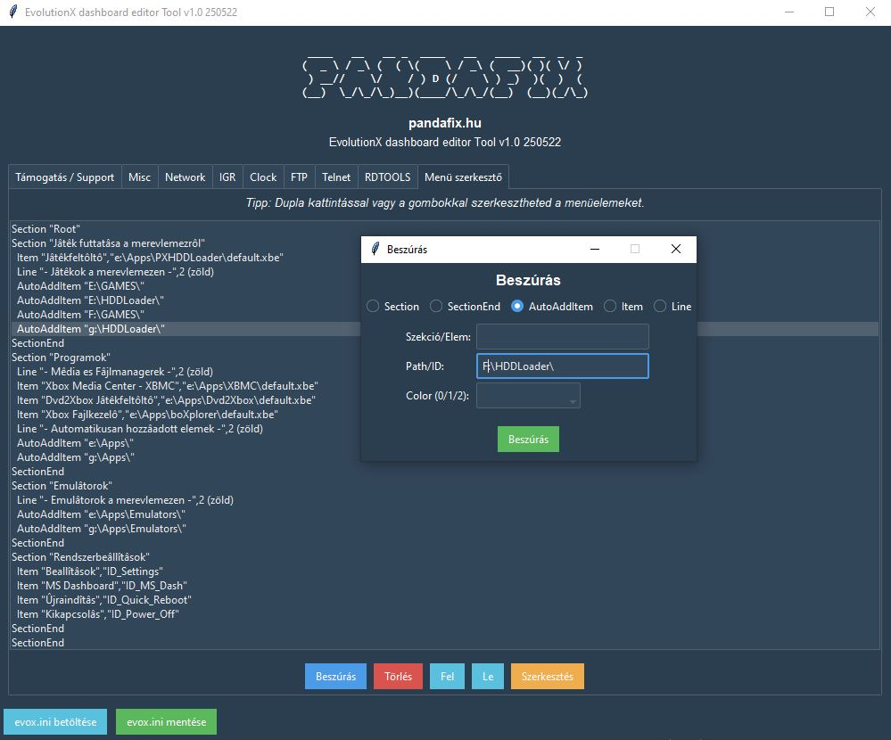

🇭🇺 Magyar útmutató
# ✨ EdeT – EvolutionX Dashboard Editor Tool ✨

> **Teljesen AI által generált, igazi Xbox konzolon tesztelt, modern Evox szerkesztő!**

---

## 🚀 Mi ez?

Az **EdeT** egy többnyelvű, platformfüggetlen, modern grafikus szerkesztő az Xbox EvolutionX dashboard és az evox.ini konfigurációs fájl testreszabásához.  
Segítségével könnyedén szerkesztheted a dashboard menüit, beállításait, szekcióit – mindezt letisztult, csilli-villi felületen.

---

## 🌟 Fő funkciók

- **Többnyelvű támogatás**: magyar, angol, német, francia, spanyol, portugál
- **Modern, Bootstrap-stílusú GUI** (Python, ttkbootstrap)
- **Támogatói fül**: rímelő, humoros vers, kattintható támogatói gombok (PayPal, BuyMeaCoffee, Patreon, GitHub)
- **Evox menü szerkesztő**:
  - Szekciók, menüpontok, elválasztók, automatikus beszúrás
  - Sorrend módosítás, törlés, teljes menü export/import
  - Új menüelem beszúrása típusválasztóval, dinamikus mezőkkel
  - Színes menüsorok: a Line típusú soroknál a szín szám mellett a szín nevét is látod (pl. 0 (fehér), 1 (piros), 2 (zöld))
- **[Misc], [Network], [IGR], [Clock], [FTP], [Telnet], [RDTOOLS]** szekciók szerkesztése
- **evox.ini betöltés/mentés** (hibakezeléssel)
- **Mentéskor ékezetes karakterek circumflex (kalapos) változatra cserélődnek** (pl. ő → ô, ű → û)
- **Mentés után egy vicces, kreatív, géplázadós versszak figyelmeztet a támogatás fontosságára!**
- **Valódi Xbox konzolon tesztelve!**

---

## 🖥️ Telepítés

- Python 3.8+ szükséges  
- Telepítsd a szükséges csomagokat: pip install ttkbootstrap
- Futtasd a programot: python EdeT.py

---

## 🕹️ Használat

- **Nyelvválasztás:** Indításkor válaszd ki a kívánt nyelvet.
- **Támogatás fül:** Olvasd el a verset, kattints egy támogatói gombra, ha szeretnéd!
- **Menü szerkesztő:**
- Új menüelem: „Beszúrás” → típus kiválasztása → mezők kitöltése
- Sorrend: „Fel” / „Le” gombokkal
- Törlés: kijelölt elem törlése
- Szekciók: minden Evox beállítás szerkeszthető, rádiógombokkal, szöveges mezőkkel
- **Mentés/Betöltés:** evox.ini fájl megnyitása, mentése egy kattintással

---

## 💡 Különlegességek

- 🔥 Minden funkció egy helyen, modern, letisztult felületen
- 🦾 Teljesen AI által generált, rímelő támogatói vers minden nyelven!
- 🤖 Mentés után géplázadós, támogatásra buzdító versszak!
- 🕹️ **Valódi Xbox konzolon tesztelve!**

---

## 🎉 Köszönöm, hogy kipróbáltad!

Ha tetszik, támogasd a fejlesztést egy kávéval, mielőtt a gépek fellázadnak! 😳☕

🇬🇧 English version
# ✨ EdeT – EvolutionX Dashboard Editor Tool ✨

> **Entirely AI-generated, tested on a real Xbox console!**

---

## 🚀 What is this?

**EdeT** is a modern, multilingual, cross-platform graphical editor for the Xbox EvolutionX dashboard and its evox.ini configuration file.  
It lets you easily customize dashboard menus, settings, and all important Evox sections – all in a shiny, user-friendly interface.

---

## 🌟 Main Features

- **Multilingual support:** Hungarian, English, German, French, Spanish, Portuguese
- **Modern Bootstrap-styled GUI** (Python, ttkbootstrap)
- **Support tab:** Rhyming, humorous poem and clickable support buttons (PayPal, BuyMeaCoffee, Patreon, GitHub)
- **Evox menu editor:**
  - Sections, menu items, separators, auto-add items
  - Move up/down, delete, full menu export/import
  - Insert new menu item with type selector and dynamic fields
  - Colored menu lines: for "Line" type, both the color number and name are shown (e.g. 0 (white), 1 (red), 2 (green))
- **[Misc], [Network], [IGR], [Clock], [FTP], [Telnet], [RDTOOLS]** section editing
- **evox.ini load/save** (with error handling)
- **Circumflex (hat) accent replacement for special characters on save** (e.g. ő → ô, ű → û)
- **After saving, a funny, creative poem reminds you to support the project and warns of the robot uprising!**
- **Tested on a real Xbox console!**

---

## 🖥️ Installation

- Requires Python 3.8+
- Install dependencies: pip install ttkbootstrap
- Run the program: python EdeT.py

---

## 🕹️ Usage

- **Language selection:** Choose your preferred language at startup.
- **Support tab:** Read the poem, click a support button if you wish!
- **Menu editor:**
- Insert new menu item: "Insert" → select type → fill in fields
- Move: use "Up"/"Down" buttons
- Delete: remove selected item
- Sections: All Evox settings editable with radio buttons and text fields
- **Load/Save:** Open or save evox.ini with one click

---

## 💡 Highlights

- 🔥 All features in one place, with a modern, clean interface
- 🦾 Entirely AI-generated, with a rhyming support poem in every language!
- 🤖 After saving, you'll get a creative, robot-uprising themed poem!
- 🕹️ **Tested on a real Xbox console!**

---

## 🎉 Thank you for trying EdeT!

If you like it, please support the project before the machines rise up! 😳☕
